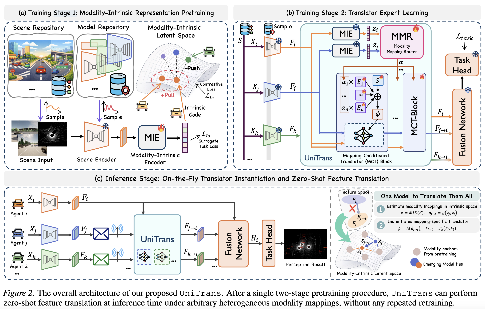

# One Model to Translate Them All: Universal Any-to-Any Translation for Heterogeneous Collaborative Perception [ICML 2026]

Official implementation of the ICML 2026 accepted paper **[ UniTrans ] One Model to Translate Them All: Universal Any-to-Any Translation for Heterogeneous Collaborative Perception**.

UniTrans addresses feature-modality heterogeneity in intermediate-fusion collaborative perception. Instead of training a dedicated adapter for every source-target modality pair, UniTrans learns a modality-intrinsic latent space and instantiates mapping-conditioned feature translators from a reusable Translator Parameter Bank. This enables zero-shot any-to-any feature translation for newly emerging heterogeneous agents.



## Highlights

- Universal any-to-any feature translation for heterogeneous collaborative perception.
- Modality-Intrinsic Encoder (MIE) for scene-invariant modality representation.
- Modality Mapping Router (MMR) and Translator Parameter Bank (TPB) for on-the-fly translator instantiation.
- Evaluation on both simulated and real-world collaborative perception settings, including OPV2V-H and DAIR-V2X.


## Installation

The environment is organized with Python 3.11, PyTorch 2.3.1, CUDA 12.1, and `spconv-cu121`.

```bash
conda create -n unitrans python=3.11 -y
conda activate unitrans

pip install -r requirements.txt
pip install -e .
```

Please prepare OPV2V / OPV2V-H style data following the data preparation instructions of [HEAL](https://github.com/yifanlu0227/HEAL) or [STAMP](https://github.com/taco-group/STAMP). Before training, update `root_dir`, `validate_dir`, and `test_dir` in the corresponding `config.yaml` files if your dataset paths differ from the defaults.

## Configuration Preparation

Copy the OPV2V configuration tree into `opencood/logs` before training. The copied tree is used as the working directory for checkpoints and generated files.

```bash
mkdir -p opencood/logs
cp -r opencood/hypes_yaml/opv2v opencood/logs/

export UNITRANS_LOG_DIR=opencood/logs/opv2v
```

## Training

### Stage 0: Homogeneous Modality Training

Train each local homogeneous modality under `local/`. Example:

```bash
python opencood/tools/train.py \
  --hypes_yaml None \
  --model_dir ${UNITRANS_LOG_DIR}/local/PointPillar/local_pp4
```

A simple loop for all local modalities:

```bash
for model_dir in $(find ${UNITRANS_LOG_DIR}/local -mindepth 2 -maxdepth 2 -type d | sort); do
  python opencood/tools/train.py \
    --hypes_yaml None \
    --model_dir ${model_dir}
done
```

After all local modalities are trained, merge their checkpoints:

```bash
python opencood/tools/merge_local_modality_pths.py \
  --input_dir ${UNITRANS_LOG_DIR}/local
```

This produces `${UNITRANS_LOG_DIR}/local/merged.pth`, which contains the modality encoders, fusion network, and task head. Copy it to the Stage 1 directory:

```bash
cp ${UNITRANS_LOG_DIR}/local/merged.pth \
  ${UNITRANS_LOG_DIR}/unitrans_modality_intrinsic_encoder/
```

### Stage 1: Modality-Intrinsic Representation Pretraining

Single-GPU training:

```bash
python opencood/tools/train_translator.py \
  --model_dir ${UNITRANS_LOG_DIR}/unitrans_modality_intrinsic_encoder
```

Multi-GPU training:

```bash
CUDA_VISIBLE_DEVICES=0,1 \
torchrun --nproc_per_node=2 --standalone \
  opencood/tools/train_translator_ddp.py \
  --hypes_yaml None \
  --model_dir ${UNITRANS_LOG_DIR}/unitrans_modality_intrinsic_encoder
```

After Stage 1, copy or symlink the selected checkpoint to `translator/unitrans` and rename it as `net_epoch1.pth`:

```bash
cp ${UNITRANS_LOG_DIR}/unitrans_modality_intrinsic_encoder/net_epoch_bestval_at*.pth \
  ${UNITRANS_LOG_DIR}/translator/unitrans/net_epoch1.pth
```

### Stage 2: Translator Expert Learning

Single-GPU training:

```bash
python opencood/tools/train_translator.py \
  --model_dir ${UNITRANS_LOG_DIR}/translator/unitrans
```

Multi-GPU training:

```bash
CUDA_VISIBLE_DEVICES=0,1 \
torchrun --nproc_per_node=2 --standalone \
  opencood/tools/train_translator_ddp.py \
  --hypes_yaml None \
  --model_dir ${UNITRANS_LOG_DIR}/translator/unitrans
```

### Baseline Translator Training

For baseline translator methods under `translator/`, place the Stage 0 `merged.pth` into each method directory except `unitrans`, then train with the same Stage 2 command pattern.

```bash
for model_dir in ${UNITRANS_LOG_DIR}/translator/*; do
  if [ "$(basename ${model_dir})" != "unitrans" ]; then
    cp ${UNITRANS_LOG_DIR}/local/merged.pth ${model_dir}/
    python opencood/tools/train_translator.py --model_dir ${model_dir}
  fi
done
```

## Inference

Batch inference over all translator methods:

```bash
python opencood/tools/run_batch_infer.py \
  --root_dir ${UNITRANS_LOG_DIR}/translator \
  --gpus 0,1 \
  --per_gpu 3 \
  --script_path opencood/tools/inference_heter_experiments.py \
  --range 102.4,51.2 \
  --use_cav "[5]" \
  --save_feat_interval 400 \
  --skip_task_if_success
```

## License

This repository uses a mixed license structure. UniTrans-original components are released for academic and non-commercial research use. Framework code adapted from OpenCOOD, HEAL, and STAMP remains subject to the corresponding upstream licenses. Please see `LICENSE` and `NOTICE` for details.

## Acknowledgements

This repository builds on the OpenCOOD ecosystem and benefits from the codebases and experimental protocols of [OpenCOOD](https://github.com/DerrickXuNu/OpenCOOD), [HEAL](https://github.com/yifanlu0227/HEAL), and [STAMP](https://github.com/taco-group/STAMP). We sincerely thank the authors of these projects for their contributions to heterogeneous collaborative perception.
